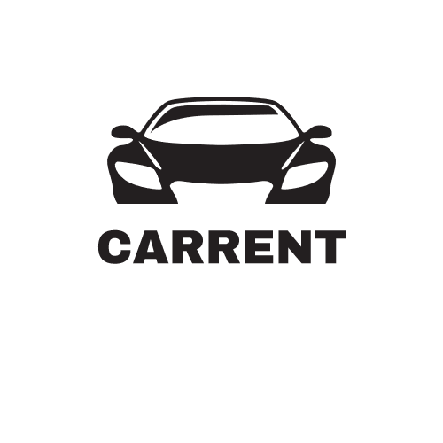

# Arc 42 Dokumentation

# Autovermietung CarRent

Diese Dokumentation wurde auf der Grundlage von arc 42 erstellt.

## Über arc42

arc42, das Template zur Dokumentation von Software- und
Systemarchitekturen.

Erstellt von Dr. Gernot Starke, Dr. Peter Hruschka und Mitwirkenden.

Template Revision: 7.0 DE (asciidoc-based), January 2017

© We acknowledge that this document uses material from the arc 42
architecture template, <http://www.arc42.de>. Created by Dr. Peter
Hruschka & Dr. Gernot Starke.

# Einführung und Ziele

## Aufgabenstellung

### Autovermietungssoftware CarRent

CarRent ist die schnelle und einfache Art, ein Auto für den nächsten Trip zu reservieren.
Die Reservierung soll einfach und unkompliziert sein.
CarRent Webclient soll für die Mitarbeiter von CarRent und deren Kunden eine intuitive Software sein um Autos zu reservieren und mieten.

Das Ziel ist eine Software, welche über Webclients gleichzeitig Fahrzeuge reserviert und verwaltet werden können.

## Qualitätsziele

1. Performance: CarRent soll schnelle Antwortzeiten (<1 Sek.) und für parallele Anfragen in kleiner Anzahl ausgelegt sein.
2. Datenqualität: Keine Redundanzen, referentielle Integrität und Datenkonsistenz.
3. Usability: Die Benutzeroberfläche soll übersichtlich und intuitiv gestaltet sein.
4. Installierbarkeit: CarRent soll einfach eingerichtet werden können.
5. Erweiterbarkeit: CarRent soll für zukünftige Erweiterungen offen sein.

## Stakeholder

| Rolle               | Kontakt            | Erwartungshaltung                              |
| ------------------- | ------------------ | ---------------------------------------------- |
| CEO CarRent         | Peter Müller       | Stabile und flexible Software, Kostenkontrolle |
| Kunden CarRent      | K.Meier Vertretung | Schnelle Antwortzeiten, Intuitive Bedienung    |
| Mitarbeiter CarRent | M. Bär Vertretung  | Inutive Bedienung, Erweiterbarkeit             |
| Softwareentwickler  | T. Canal           | Klare Anforderungen                            |
| Softwareentwickler  | G. Weibel          | Klare Anforderungen                            |

# Randbedingungen

<dl>
<dt> Developer Tools </dt>
<dd> VS 2019 / R#Sharper / SonarLint </dd>
<dd> Visual Studio Code </dd>
<dt>  Client Tier </dt>
<dd> Vue mit TypeScript und anderen componenten aus npm </dd>
<dd> npm </dd>
<dt>  Server Tier </dt>
<dd> ASP.NET Core </dd>
<dd> Entity Framework Core </dd>
<dd> Pomelo MySql Entity Framework Core Driver </dd>
<dt>  Testing </dt>
<dd> NUnit, FakeItEasy </dd>
<dt>  Data Tier (Choose) </dt>
<dd> MySql Server 8.0 </dd>
<dt>  Build, Release und Metrik Tools </dt>
<dd> NuGet </dd>
<dd> npm </dd>
<dd> Sonar </dd>
<dd> ReSharper </dd>
<dd> AzureDevOps Build Pipeline mit Sonar und automatischen Tests </dd>
</dl>

# Kontextabgrenzung

CarRent ist ein egenständiges Reservierungssystem für Autos.
Systemintern gibt es eine Schnittstelle zwischen GUI und BussinesAplication sowie zwischen BussinesAplication und Datenbank.  
CarRent hat keine Schnittstellen zu Fremdsystemen wie z.B. Zahlungssystemen oder Reparaturverwaltung für Autos.

## Fachlicher Kontext

Kunden benutzen in einer ersten Phase das CarRent System nur über einen Sachbearbeiter. Der Sachbearbeiter führt alle interaktionen mit dem CarRent-System über das WebFrontend.
In einer späteren Phase erhalten die Kunden ein eigenes Benutzerinterface. In diese können sie dann selbstständig Autos reservieren.

## Technischer Kontext

Über ein WebBrowser wird via HTTPS auf den WebClient zugegriffen.
Der WebClient macht seinerseitz Abragen über HTTPS auf die WebAPI.
Diese speichert dann die Daten in der MySql Datenbank mittels OR-Mapper.

# Lösungsstrategie

Die folgende Tabelle stellt die Qualitätsziele von CarRent passenden Architekturansätzen gegenüber, und erleichtert so einen Einstieg in die Lösung.

| Qualitätsziel     | Dem Qualitätsziel zuträgliche Ansätze in der Architektur                               |
| ----------------- | -------------------------------------------------------------------------------------- |
| Performance       | mit den HTTPS Requests werden nur einzelne Daten abgefragt, keine komplexen Strukturen |
| Datenqualität     | Die MySql Datenbank übernimmt die persistente Speicherung der Daten.                   |
| Usability         | Das WebFrontend wird mit Vue einach und übersichtlich gestaltet.                       |
| Installierbarkeit | Das WebFrontend benötigt keine Installation.                                           |
| Erweiterbarkeit   | Objektorientierte Programmierung und stabile Interfaces.                               |

# Bausteinsicht

## Whitebox Gesamtsystem

### Enthaltene Bausteine

<dl>
<dt>Kunden</dt>
<dd>Enthält Kundendaten. Kunde muss zuerst eine Klasse wählen, erst dann kann er eine effektives Auto wäheln</dd>
<dt>Autos</dt>
<dd>Auto beinthält die Informationen zu den jeweiligen Autos. Ein Auto ist eine bestimmtem bestimmten Modell zugeordnet. Das Modell wiederum gehört zu einer Kategorie (Klasse) und einer Marke</dd>
<dt>Reservations</dt>
<dd>Eine Reservation benötigt ein Kunde, eine Autoklasse, dann ein spezifisches Auto. Dieses Auto wird dann für eine Anzahl Tage reserviert.</dd>
</dl>
<dt>Contracts</dt>
<dd>Hier sind die Mietverträge enthalten. Sie treten dann in Kraft, wenn das Auto abgeholt wird.</dd>
</dl>

# Laufzeitsicht

Eine Laufzeitsicht ist im Moment nicht dokumentiert, da kein komplexer Ablauf gefordert ist.

# Verteilungssicht

## Infrastruktur Ebene

**Begründung**

Die Vorgabe des Projekts war für die Infrastruktur entscheidend und musste wie folgt beschrieben umgesetzt werden:

> Das System soll aus einem Server-Teil und einem Web-Client bestehen. Die Daten sollen mittels OR-Mapper oder ADO.NET in eine relationale Datenbank gespeichert werden können. Die Business Logik soll auf einem Application Server laufen und einen RESTFul WebService Schnittstelle (WebAPI) anbieten. Der Web-Client benutzt die WebAPI um die Funktionen auszuführen.

# Domänenkonzepte

# Entwurfsentscheidungen

Wir haben uns für MySql entschieden, da wir bereits Erfahrung mit MySql und Entity Framework Core haben.
Azure kam zum Zug, da ein automatisches CI/CD einfach umzusetzen ist.
Weiter haben wir uns für Vue entschieden, da es ein aktueller Standard der Webentwicklung ist und wir ebenfalls erfahren darin sind.
SonarQube wurde zur Messung von Metriken eingesetzt, da wir dies einmal ausprobieren wollten.

# Qualitätsanforderungen

<dl>
<dt>Codemetriken:</dt>
<dd>Wir setzen auf die Qualitätsregeln welche in SonarQube standardmässig hinterlegt sind. Mit Ausnahme von Codecoverage, da wir nei so eine hohe Coverage erreichen können in diesem Projekt. SonarQube lässt den Build failen, wenn das Qualtygate nicht erreicht wird.</dd>
<dt>Installierbarkeit</dt>
<dd>Eine automatisches Deployment haben wir nur geplant. Wir können es aber nicht umsetzen. Weil uns da Berechtigungen Fehlen.</dd>
<dt>Usability</dt>
<dd>Durch den Einsatz von Bootstrap Komponenten wird die Benutzerfreundlichkeit und Accessibility (Bedienbarkeit für beeinträchtigete Benutzer) automatisch unterstützt. </dd>
</dl>

# Risiken und technische Schulden

Durch das Setzen von der Umgebungsvariabel "Development" wurde auf der Azure sichergestellt, dass Datenmanipulationen nicht permanent sind und mit Beispieldaten vorabgefült sind. Und bei einem Recycle der API zurückgesetzt werden. Durch setzen der Umgebungsvariabel "Production" wird Entity Framework als Persistentzschicht aktiviert. Da die Seite nicht geschützt ist, wollen wir so verhindern, dass unbefugte Manipulationen auf der Datenbank durchgeführt werden.  
Durch die kurze Entwicklungszeit sind nur begrenzt Tests geschrieben.
Für eine Erweiterung der Software sollte erst eine grosse Testabdeckung erreicht werden.
Weiter sollte ein separates GUI für den Kunden entworfen werden, damit der Kunde nicht mehr über den Sachbearbeiter Autos reservieren kann.  
Der Logging-Kontext ist zur Zeit noch nicht umgesetzt.

# Glossar

| Begriff          | Definition                                |
| ---------------- | ----------------------------------------- |
| Entity Framework | Object-Relationship Mapper für MSSQL      |
| Material Design  | ist eine Designrichtlinie von Google      |
| Accessibility    | Bedienhilfe für beeinträchtigete Benutzer |
